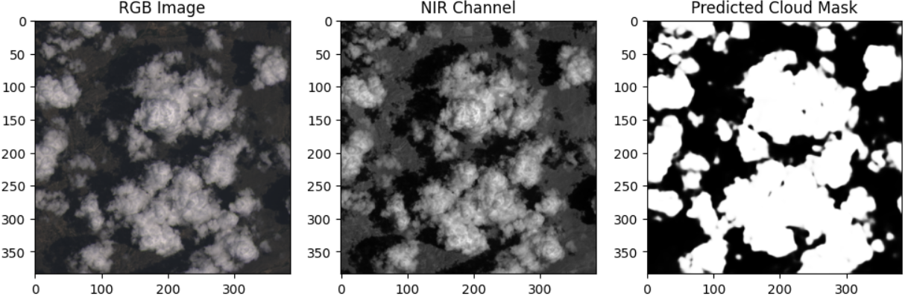

# Cloud Segmentation in Satellite Images

**Author:** Praveen V.V.J  

This project implements a custom U-Net convolutional neural network (CNN) to segment clouds in remote sensing satellite images. The model is trained on the 38-Cloud Kaggle dataset and can perform pixel-level cloud detection on Landsat 8 images. Preprocessing of the multi-spectral channels ensures accurate analysis of satellite data.

---

## About Remote Sensing

Remote sensing refers to the acquisition of information about an object or area from a distance, typically using satellites or aerial sensors. In this project, Landsat 8 satellite images are used, which provide multi-spectral data for environmental monitoring. Cloud segmentation is an important preprocessing step in satellite image analysis, as clouds can obstruct observations and affect downstream tasks such as land cover classification, vegetation monitoring, or climate studies.

---

## About the Dataset

**Dataset Name:** 38-Cloud: Cloud Segmentation in Satellite Images  
**Link:** [Kaggle - 38-Cloud](https://www.kaggle.com/datasets/sorour/38cloud-cloud-segmentation-in-satellite-images)

**Context:**  
This dataset contains 38 Landsat 8 scene images along with manually extracted pixel-level ground truths for cloud detection.

**Content:**  
- Images are cropped into multiple 384×384 patches suitable for deep learning-based semantic segmentation.  
- Training patches: 8400  
- Testing patches: 9201  

Each patch contains 4 spectral channels:  
- Red (band 4)  
- Green (band 3)  
- Blue (band 2)  
- Near Infrared (band 5)  

Unlike standard RGB images, these channels are provided separately and require preprocessing before being input into the CNN.

---

## Features

- Custom U-Net CNN architecture for cloud segmentation.
- Preprocesses multi-spectral Landsat 8 channels for deep learning.
- Generates pixel-level segmentation masks for clouds.
- Includes training, evaluation, and visualization scripts.
- Can be extended for real-time or large-scale satellite image analysis.

---

## Output

Example predicted cloud masks generated by the custom U-Net model:

  
  

